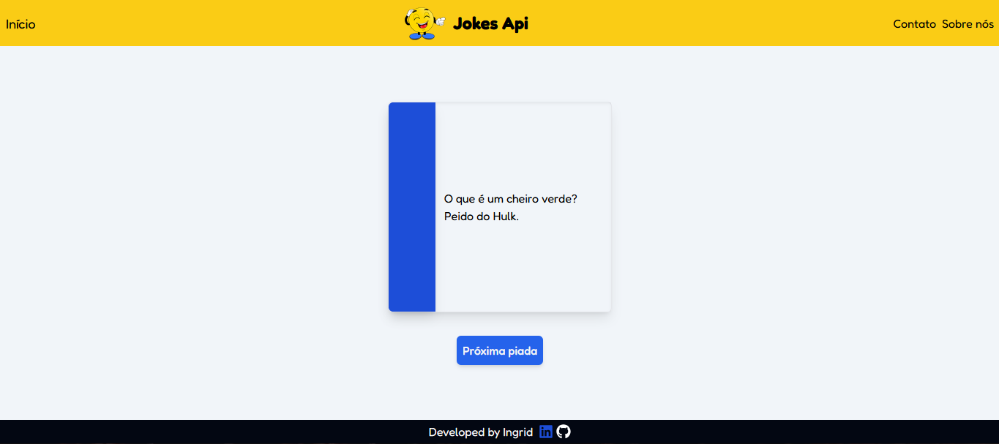

# Landing Page Jokes
Este projeto é uma landing page simples e responsiva desenvolvida com React, TypeScript e Tailwind CSS, que consome dados da Jokes API. O objetivo da página é exibir uma lista de piadas atualizadas, oferecendo uma interface amigável, com um design moderno e navegação otimizada para diferentes tamanhos de tela.

This project was bootstrapped with [Create React App](https://github.com/facebook/create-react-app).

## 🔥 Funcionalidades
* Integração com a Jokes API para exibir uma lista de piadas.

* Utilização de async/await e useEffect para realizar chamadas à API e atualizar os dados dinamicamente.

### 🔨 Guia de instalação
Instalação:

    1.Clone o repositório.

    2.Execute npm install para instalar as dependências.

Passo a Passo para Rodar:

    Execute npm start para iniciar o servidor de desenvolvimento.
    
    Acesse http://localhost:3000 no navegador para utilizar a aplicação.

## 📦 Tecnologias usadas:
 
 

## 👷 Autores

* **Ingrid Souza** - *Front-End* - [GitHub](https://github.com/IngridsSilveira)